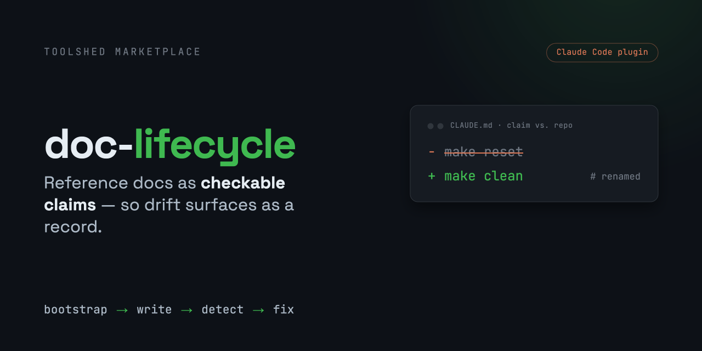

<p align="center">
  
</p>

# doc-lifecycle

<p align="center">
  <a href="LICENSE"></a>
  
  <a href="https://docs.claude.com/en/docs/claude-code/plugins"></a>
</p>

**Stale docs don't fail loudly — they get acted on.** A `CLAUDE.md` says `make reset` resets state and the worker "accepts schema 2, exits 5." The code moves; the doc doesn't. Now an agent runs a command that no longer exists and writes an error handler for the wrong exit code:

```diff
  what the doc claims          the code as of today
- make reset                   make clean              (target renamed)
- schema 2 → exits 5           schema 3 → exits 4      (worker bumped)
```

`doc-lifecycle` is a Claude Code plugin that turns that silent failure into a **record**: docs whose job is to track the repo are written so every line is a claim checkable against the code — which means drift can be *detected* with evidence and *fixed* surgically, instead of discovered mid-incident.

## Install

```
/plugin marketplace add aj604/toolshed
/plugin install doc-lifecycle@toolshed
```

## Then just ask

The skills trigger on ordinary requests — there are no new commands to learn:

| You say | What runs | What you get back |
|---------|-----------|-------------------|
| "document this project" | `bootstrapping-docs` | the smallest high-leverage doc set for an undocumented repo — then it deliberately stops |
| "is the README still accurate?" | `detecting-doc-drift` | a structured drift report: every claim verified, stale, or unverifiable, each with evidence |
| "apply that drift report" | `fixing-doc-drift` | each flagged line fixed surgically — nothing the report didn't authorize gets touched |
| any edit to a README / runbook / `CLAUDE.md` | `writing-docs` | a doc where every line is a claim verifiable against the repo |

## What a drift audit hands you

Not "the docs look a bit stale" — a machine-checkable record per claim. This is the worked example from the skill's own [output contract](plugins/doc-lifecycle/skills/detecting-doc-drift/output-contract.md):

```json
{
  "claim": "Reset state = `make reset`",
  "location": "CLAUDE.md:18",
  "kind": "command",
  "tier": 1,
  "verdict": "STALE",
  "evidence": "Makefile has `clean:`, no `reset` target",
  "fix": "Reset state = `make clean`"
}
```

Three properties make this more than a report:

- **Every verdict carries evidence** — including `VERIFIED`. "Looks consistent" is not a verdict.
- **`fix` is the complete replacement line**, not an instruction — so `fixing-doc-drift` can land it as a one-hunk diff without re-deciding anything.
- **The shape is enforced mechanically** — a bundled validator ([`validate-drift-output.py`](plugins/doc-lifecycle/skills/detecting-doc-drift/scripts/validate-drift-output.py), stdlib-only) rejects malformed records and emits a recomputed `summary` line automation can gate on.

## What's in it

| Component | Type | Use it when |
|-----------|------|-------------|
| `bootstrapping-docs` | skill | Pointing at an undocumented repo — produces the smallest high-leverage doc set, then deliberately stops. |
| `writing-docs` | skill | Writing or editing a repo-tracking doc (README, runbook, CLAUDE.md/AGENTS.md, reference), human- or agent-facing — every line a verifiable claim, rationale marked and anchored; carries the agent-density bar and routes heavy agent docs to the `llm-doc-writer` agent. |
| `detecting-doc-drift` | skill | Auditing docs against the code — extracts each claim, verifies it at the cheapest sufficient tier, emits a structured, parseable record. |
| `fixing-doc-drift` | skill | Applying a drift report to the docs — lands each STALE fix surgically, never deletes, never touches what the report didn't flag, stops on a large blast radius. |
| `llm-doc-writer` | agent | A dispatchable subagent that produces LLM-optimized documentation with maximum context efficiency. |

## Why this works where "keep the docs updated" doesn't

The suite shares one contract: **a repo-tracking doc is a set of claims.** Every line is either a **verifiable claim** — a command, path, symbol, behavior, or structure checkable against the repo *as it is now* — or a **rationale claim**, the "why," quarantined to a marked section and **anchored** to a `file:line` ref. Anything else — marketing prose, an aspirational "should," a restatement of the file tree — gets cut. (Tutorials, conceptual overviews, and design-rationale docs are narrative by design and out of scope; the claim bar would wrongly gut them.)

The bar is mechanical enough that tooling enforces its *shape* — every claim carries evidence, every verdict a valid enum — without leaning on a reviewer's patience. What tooling does **not** do is decide whether a claim is *true*: that's model judgment at the chosen verification tier, and a cheap static check confirms a path still resolves, not that it still means the same thing. The contract makes drift *checkable*; it doesn't make correctness *automatic*.

That one contract runs through the whole suite, which is what lets the pieces compose instead of fight:

```
writing-docs        mandates verifiable claims
detecting-doc-drift extracts and verifies those same claims, with evidence
fixing-doc-drift    lands the drafted fixes, one diff hunk per record
─── not yet built ───
doc-sync-automation runs detect→fix on every diff and opens a PR
```

The four skills above ship today. The automation layer on top — `doc-sync-automation`, which runs detect→fix unattended on every diff and opens a docs-update PR — is the suite's next addition; it's wiring on top of the contract, which already lives in `detecting-doc-drift` and `fixing-doc-drift`.

## How it was built

Every skill was written test-first — RED (baseline agents fail) → GREEN (skill fixes it) → REFACTOR (pressure-test for loopholes). Rules target failures that actually showed up in baseline runs, not best-practice folklore. Test records live under [`tests/`](tests/). This README follows the plugin's own contract — every line above is a claim you can check against this repo.

## Try it locally

```
/plugin marketplace add /path/to/toolshed
/plugin install doc-lifecycle@toolshed
```

## About this repo

`toolshed` is a personal [Claude Code plugin marketplace](https://docs.claude.com/en/docs/claude-code/plugins); `doc-lifecycle` is the one plugin it ships today.

```
.claude-plugin/marketplace.json   # the toolshed marketplace
plugins/doc-lifecycle/            # the published plugin
  .claude-plugin/plugin.json
  skills/                         # 4 skills
  agents/                         # llm-doc-writer
assets/                           # social-card.png (README hero + GitHub social preview)
docs/                             # plans: design docs + handoff (not part of the installed plugin)
tests/                            # RED/GREEN records + fixtures (not part of the installed plugin)
```

## License

MIT — see [`LICENSE`](LICENSE).
