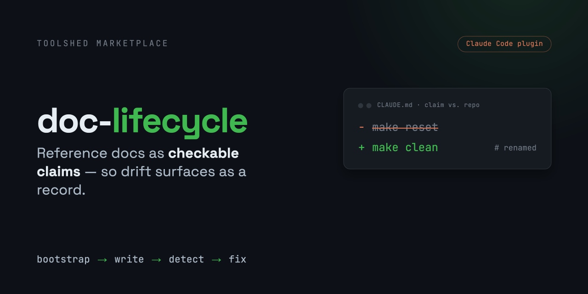

> **Repository structure:** `toolshed` is the Claude Code marketplace; [`doc-lifecycle`](plugins/doc-lifecycle/) is the plugin it currently publishes. The repository and install commands use the marketplace name.

<p align="center">
  
</p>

# doc-lifecycle

<p align="center">
  <a href="LICENSE"></a>
  
  <a href="https://docs.claude.com/en/docs/claude-code/plugins"></a>
</p>

**Documentation that can prove it's still true.**

`doc-lifecycle` is a Claude Code plugin that treats your README, runbooks, and `CLAUDE.md` as sets of claims checkable against the code. Ask **"is the README still accurate?"** and it verifies each claim — then hands you a report where every verdict carries evidence and every stale claim carries a ready-to-land fix:

```diff
  what the doc claims          the code as of today
- make reset                   make clean              (target renamed)
- schema 2 → exits 5           schema 3 → exits 4      (worker bumped)
```

Stale docs like these don't fail loudly — an agent (or a teammate) just acts on them: runs a command that no longer exists, writes an error handler for the wrong exit code. `doc-lifecycle` turns that silent failure into a **record**, auditable on both axes docs fail on — **drift** (the claim is now false) and **bloat** (the claim is true but no longer earns its tokens) — and fixable surgically, instead of discovered mid-incident.

<p align="center">
  
</p>
<p align="center">
  <sub>Scripted replay (generated by <a href="assets/demo/make_cast.py"><code>assets/demo/make_cast.py</code></a>) — the code checked is the real <a href="tests/fixtures/taskflow"><code>tests/fixtures/taskflow</code></a> fixture, and the record shown is the output contract's worked example.</sub>
</p>

## Install

```
/plugin marketplace add aj604/toolshed
/plugin install doc-lifecycle@toolshed
```

Developing against a local checkout? `/plugin marketplace add /path/to/toolshed` instead.

Then, in an ordinary session, just ask:

> is the README still accurate?

No flags, no config — installing schedules nothing and changes nothing; the skills trigger on ordinary requests in your sessions, and every doc edit flows through your approval. Unattended automation exists — it's the last row of the table below, and explicitly opted into.

## Pick your starting point

Start with **[the principles](docs/guides/principles.md)** — one page on the model everything shares: docs as checkable claims, propose → approve → apply, automation as a graduation. Then:

| Your repo today | You say | Guide |
|-----------------|---------|-------|
| No docs yet | "document this project" | [Starting docs from scratch](docs/guides/starting-docs-from-scratch.md) |
| Docs exist — are they still true? | "is the README still accurate?" | the drift loop — demoed above, [dissected below](#what-an-audit-hands-you) |
| Docs exist — accurate, but heavy | "audit the docs for bloat" | [Auditing and fixing bloat](docs/guides/auditing-doc-bloat.md) |
| The drift loop feels routine — audit it unattended | "set up doc sync" | [Turning on the nightly](docs/guides/scheduling-doc-sync.md) |

Two skills need no starting point because they trigger on the way: any edit to a README / runbook / `CLAUDE.md` invokes `writing-docs` (every line a verifiable claim), and "should we document X?" invokes `growing-docs` (demand signals grow docs; calendars don't).

## What an audit hands you

Not "the docs look a bit stale" — a machine-checkable record per claim. This is a record from the worked example in the drift skill's own [output contract](plugins/doc-lifecycle/skills/detecting-doc-drift/output-contract.md):

```json
{
  "claim": "Reset state = `make reset`",
  "location": "CLAUDE.md:18",
  "kind": "command",
  "tier": 1,
  "verdict": "STALE",
  "evidence": "Makefile has `clean:`, no `reset` target",
  "fix": "Reset state = `make clean`"
}
```

Three properties make this more than a report:

- **Every verdict carries evidence** — including `VERIFIED`. "Looks consistent" is not a verdict.
- **`fix` is the complete replacement line**, not an instruction — so `fixing-docs` can land it as a one-hunk diff without re-deciding anything.
- **The shape is enforced mechanically** — a bundled validator ([`validate-drift-output.py`](plugins/doc-lifecycle/skills/detecting-doc-drift/scripts/validate-drift-output.py), stdlib-only) rejects malformed records and emits a recomputed `summary` line automation can gate on.

Closing the loop is one more request — "apply that drift report" — and `fixing-docs` lands each approved `STALE` record's `fix` at its `location`, touching nothing the report didn't flag.

Bloat audits emit the same contract shape — ID'd records, a fixed verdict enum, cited evidence, [their own validator](plugins/doc-lifecycle/skills/detecting-doc-bloat/scripts/validate-bloat-output.py) — and go through the same door: you approve fixes **by record ID**, and `fixing-docs` mints that selection into the approval set the applier will not write without — the ID is how you say it, the record's digest is what gets bound. The [bloat guide](docs/guides/auditing-doc-bloat.md) walks one end to end.

## What's in it

| Component | Type | Use it when |
|-----------|------|-------------|
| `bootstrapping-docs` | skill | Pointing at an undocumented repo — produces the smallest high-leverage doc set, then deliberately stops, recording deferrals in `docs/doc-scope.md`. |
| `growing-docs` | skill | Baseline docs exist but a demand signal says they fall short — writes the one artifact that absorbs the signal, then stops. The demand-driven counterpart to `bootstrapping-docs`. |
| `writing-docs` | skill | Writing or editing a repo-tracking doc (README, runbook, CLAUDE.md/AGENTS.md, reference), human- or agent-facing — every line a verifiable claim, rationale marked and anchored; carries the agent-density bar and routes heavy agent docs to the `llm-doc-writer` agent. |
| `detecting-doc-drift` | skill | Auditing docs against the code for **accuracy** — extracts each claim, verifies it at the cheapest sufficient tier, emits a structured, parseable record. |
| `detecting-doc-bloat` | skill | Auditing docs for low-value content — redundant, verbose, duplicated, or past its useful form — emits a structured prune/condense/distill proposal. Read-only: it proposes, a human approves. |
| `fixing-docs` | skill | Applying an audit report — drift and bloat records alike, through one door: the IDs you approve mint an approval set, which becomes an edit plan the applier (`python3 -m doclifecycle apply-plan`) lands, and you get the staged diff back. The approval set is the only authority; nothing the report didn't flag gets touched. |
| `scheduling-doc-sync` | skill | Wiring a repo for unattended auditing — installs the nightly **read-only** audit Action (it publishes a report and can write nothing), the manual apply dispatch that lands exactly the records you approve and opens a real PR, and the weekly self-upgrade check. |
| `llm-doc-writer` | agent | A dispatchable subagent that produces LLM-optimized documentation with maximum context efficiency. |
| `doc-distiller` | agent | Handles one approved DISTILL record — verifies each durable claim, then returns the edit-plan operations that put the extractions in their living docs and retire the planning artifact, landed by the same applier as every other approved record. Dispatched by `fixing-docs`. |

## Why this works where "keep the docs updated" doesn't

The suite shares one contract: **a repo-tracking doc is a set of claims** — verifiable against the repo as it is now, or rationale explicitly marked and anchored. That bar is what makes drift *detectable*, bloat *judgeable*, and fixes *reviewable*; the full argument, with pointers into the skill files that enforce it, is one page: **[docs/guides/principles.md](docs/guides/principles.md)**.

The same contract is what lets the pieces compose instead of fight:

```
writing-docs          mandates verifiable claims
detecting-doc-drift   audits those claims for accuracy   ┐
                                                         ├→ fixing-docs lands approved fixes
detecting-doc-bloat   audits those claims for weight     ┘
scheduling-doc-sync   installs the Actions that run the drift loop on a schedule and open the PR you approve
```

All of the above ships today. The automation layer — `scheduling-doc-sync` — installs a nightly GitHub Action that audits the whole documentation corpus unattended and publishes a report it has no permission to act on, plus a manual dispatch you hand the record digests you approve, which applies exactly those and opens a real pull request. The schedule can only ever propose; landing anything takes two deliberate acts from you. Both lanes are wiring on top of the contract, which lives in the detect skills, the one fix door, and the engine they share.

## How it was built

Every skill was written test-first — RED (baseline agents fail) → GREEN (skill fixes it) → REFACTOR (pressure-test for loopholes). Rules target failures that actually showed up in baseline runs, not best-practice folklore. Test records live under [`tests/`](tests/). This README follows the plugin's own contract — every line above is a claim you can check against this repo.

And the loop is closed in this repo's own history: on its first nightly run here (2026-07-02), the scheduled lane of the day caught two stale claims in these very docs — one falsified by the commit that installed it — and opened [the evidence PR](https://github.com/aj604/toolshed/pull/5) that fixed them. Full record: [`tests/baselines/doc-sync-setup-red/DOGFOOD-first-catch.md`](tests/baselines/doc-sync-setup-red/DOGFOOD-first-catch.md). That lane has since been replaced by the read-only audit and the manual apply dispatch this repo now runs on itself.

## About this repo

`toolshed` is a personal [Claude Code plugin marketplace](https://docs.claude.com/en/docs/claude-code/plugins); `doc-lifecycle` is the one plugin it ships today.

```
.claude-plugin/marketplace.json   # the toolshed marketplace
plugins/doc-lifecycle/            # the published plugin
  .claude-plugin/plugin.json
  skills/                         # 7 skills
  agents/                         # llm-doc-writer, doc-distiller
assets/                           # social-card.png (hero + GitHub social preview),
                                  #   drift-audit-demo.svg + demo/make_cast.py (its generator)
docs/                             # guides: user-facing walkthroughs; plans: design docs +
                                  #   handoff (not part of the installed plugin)
tests/                            # RED/GREEN records + fixtures (not part of the installed plugin)
```

## License

MIT — see [`LICENSE`](LICENSE).
